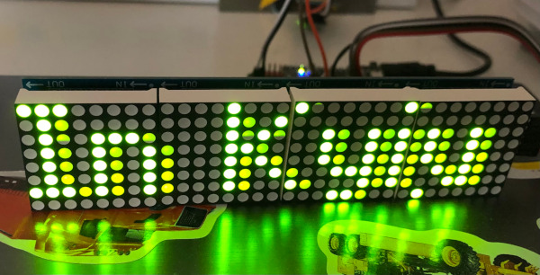

# WeatherStation

## IoT led weather ticker 

### We used electronic components:
<ol>
  <li>ESP-01 <i>(Sketch Weather)</i></li>
  <li>Arduino Nano <i>(sketch Matrix)</i></li>
  <li>Led Matrix 4 pieces 8x8</li>
  <li>Cables, box, AC/DC...</li>
</ol>

### We used software:
<ol>
  <li>MD_Parola</li>
  <li>ArduinoJson</li>
  <li>ESP8266HTTPClient</li>
  <li>AltSoftSeial</li>
  <li>Alex Gyver's helper libs...</li>
</ol>

### Algorithm:
<ol>
  <li>GET request from OpenWeather</li>
  <li>Parse Json response</li>
  <li>Async send the string from ESP to Nano </li>
  <li>Nano runs the ticker on LED Matrix</li>
</ol>

### What we'v got:

  

